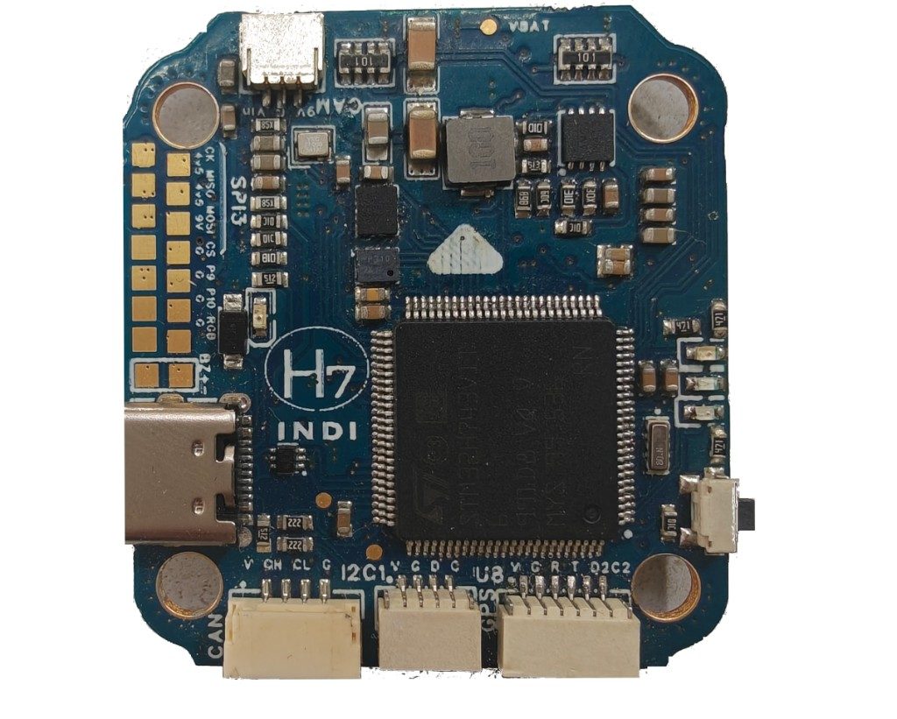
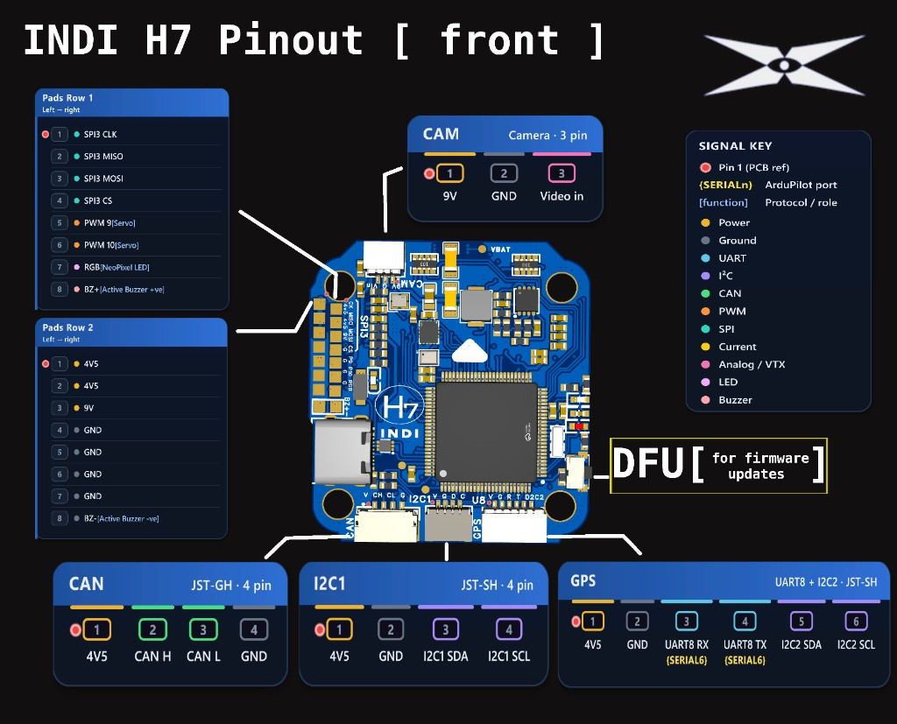

# IndiH743 Flight Controller

The IndiH743 is an STM32H743 flight controller produced by [8OL Robotics](https://www.8olrobotics.com).

## Where to Buy

- [Biji Pathfinders](https://bijipathfinders.com/product/indi-h7-flight-controller/)
- [8OL Robotics](https://www.8olrobotics.com)

## Features

- STM32H743 microcontroller, 480 MHz, 2 MB Flash
- BMI088 and ICM-42688-P / ICM-45686 IMUs
- DPS310 barometer
- AT7456E OSD
- microSD card slot
- 7 UARTs, CAN, external I2C
- 10 PWM/DShot outputs (bi-directional DShot on 1, 3, 5, 7) plus RGB LED pad
- Analog and digital / HD VTX connectors
- 2S–6S input; 9V and 4V5 BECs
- 42.4 × 39.5 × 9 mm, 30.5 × 30.5 mm M3 mounting

## Pinout

`{SERIALn}` is the ArduPilot serial port. `[…]` is a protocol / role note.

### CAN — JST-GH

| Pin | Signal |
|-----|--------|
| 1   | 4V5    |
| 2   | CAN H  |
| 3   | CAN L  |
| 4   | GND    |

### UART1 (Telem1) — JST-SH

| Pin | Signal             |
|-----|--------------------|
| 1   | 4V5                |
| 2   | GND                |
| 3   | UART1 RX {SERIAL1} |
| 4   | UART1 TX {SERIAL1} |

### UART2 (Telem2) — JST-SH

| Pin | Signal             |
|-----|--------------------|
| 1   | 4V5                |
| 2   | GND                |
| 3   | UART2 RX {SERIAL2} |
| 4   | UART2 TX {SERIAL2} |

### UART4 (RC) — JST-SH

| Pin | Signal             |
|-----|--------------------|
| 1   | 4V5                |
| 2   | GND                |
| 3   | UART4 RX {SERIAL4} |
| 4   | UART4 TX {SERIAL4} |

### CAM — JST-SH

| Pin | Signal   |
|-----|----------|
| 1   | 9V       |
| 2   | GND      |
| 3   | Video in |

### VTX (Analog) — JST-SH

| Pin | Signal                          |
|-----|---------------------------------|
| 1   | 9V                              |
| 2   | GND                             |
| 3   | VTX                             |
| 4   | USART3 TX {SERIAL3} [IRC Tramp] |

### I2C1 — JST-SH

| Pin | Signal   |
|-----|----------|
| 1   | 4V5      |
| 2   | GND      |
| 3   | I2C1 SDA |
| 4   | I2C1 SCL |

### GPS — JST-SH

| Pin | Signal             |
|-----|--------------------|
| 1   | 4V5                |
| 2   | GND                |
| 3   | UART8 RX {SERIAL6} |
| 4   | UART8 TX {SERIAL6} |
| 5   | I2C2 SDA           |
| 6   | I2C2 SCL           |

### Digital VTX — JST-SH

| Pin | Signal                     |
|-----|----------------------------|
| 1   | 9V                         |
| 2   | GND                        |
| 3   | USART3 TX {SERIAL3} [MSP]  |
| 4   | USART3 RX {SERIAL3} [MSP]  |
| 5   | GND                        |
| 6   | USART6 RX {SERIAL7} [SBUS] |

Analog VTX and Digital VTX share USART3 TX. SERIAL3 defaults to IRC Tramp (`44`) with half-duplex (`SERIAL3_OPTIONS` = 4). For MSP DisplayPort use `SERIAL3_PROTOCOL` = 42 and `SERIAL3_OPTIONS` = 0; set `OSD_TYPE2` = 5 if using HD OSD with the onboard analog OSD.

### ESC 1 — JST-SH

| Pin | Signal                             |
|-----|------------------------------------|
| 1   | VBAT                               |
| 2   | GND                                |
| 3   | CURRENT SENSE 1                    |
| 4   | UART7 RX {SERIAL5} [ESC Telemetry] |
| 5   | PWM1                               |
| 6   | PWM2                               |
| 7   | PWM3                               |
| 8   | PWM4                               |

### ESC 2 — JST-SH

| Pin | Signal                             |
|-----|------------------------------------|
| 1   | VBAT                               |
| 2   | GND                                |
| 3   | CURRENT SENSE 2                    |
| 4   | UART7 RX {SERIAL5} [ESC Telemetry] |
| 5   | PWM8                               |
| 6   | PWM7                               |
| 7   | PWM6                               |
| 8   | PWM5                               |

### Pads (left to right)

#### Row 1

| Pad | Signal                  |
|-----|-------------------------|
| 1   | SPI3 CLK                |
| 2   | SPI3 MISO               |
| 3   | SPI3 MOSI               |
| 4   | SPI3 CHIP SELECT        |
| 5   | PWM 9 [Servo]           |
| 6   | PWM 10 [Servo]          |
| 7   | RGB [NeoPixel LED]      |
| 8   | BZ+ [Active Buzzer +ve] |

#### Row 2

| Pad | Signal                  |
|-----|-------------------------|
| 1   | 4V5                     |
| 2   | 4V5                     |
| 3   | 9V                      |
| 4   | GND                     |
| 5   | GND                     |
| 6   | GND                     |
| 7   | GND                     |
| 8   | BZ- [Active Buzzer -ve] |

## UART Mapping

- SERIAL0 -> USB
- SERIAL1 -> USART1 (Telem1)
- SERIAL2 -> USART2 (Telem2)
- SERIAL3 -> USART3 (Analog VTX TX default IRC Tramp; Digital VTX TX/RX)
- SERIAL4 -> UART4 (RC)
- SERIAL5 -> UART7 (ESC telemetry)
- SERIAL6 -> UART8 (GPS)
- SERIAL7 -> USART6 (Digital VTX SBUS RX; `SERIAL7_OPTIONS` = 1 by default)

## RC Input

RC input is on UART4 by default. It supports all serial RC protocols except PPM. See [RC systems](https://ardupilot.org/copter/docs/common-rc-systems.html).

- SBUS/DSM/SRXL: UART4 RX; `SERIAL4_OPTIONS` = 1 for SBUS
- FPort: also use TX; `SERIAL4_OPTIONS` = 15
- CRSF/ELRS: TX and RX; `SERIAL4_OPTIONS` = 0
- DJI / HD air-unit SBUS: Digital VTX pin 6 (SERIAL7); set `SERIAL7_PROTOCOL` = 23

## OSD Support

Onboard analog OSD uses `OSD_TYPE` = 1 (AT7456E). Connect camera to CAM and analog VTX to the Analog VTX connector. For digital / HD VTX, reconfigure SERIAL3 for MSP DisplayPort as noted above.

## PWM Output

- PWM 1–4 on ESC 1
- PWM 5–8 on ESC 2
- PWM 9–10 on side pads
- RGB on PWM11 (`SERVO11_FUNCTION` = 120 by default)

PWM groups:

- PWM 1–2 group1
- PWM 3–6 group2
- PWM 7–10 group3
- PWM 11 group4

Channels in a group must share the same output rate. If any channel in a group uses DShot, all must use DShot. Bi-directional DShot is enabled on PWM 1, 3, 5 and 7.

## Battery Monitoring

Internal voltage sense is shared by BATT and BATT2. ESC1 / ESC2 current sense inputs are BATT / BATT2 current.

- BATT_MONITOR = 4 / BATT2_MONITOR = 4
- BATT_VOLT_PIN = 10 / BATT2_VOLT_PIN = 10
- BATT_CURR_PIN = 11 / BATT2_CURR_PIN = 7
- BATT_VOLT_MULT = 10.969 / BATT2_VOLT_MULT = 10.969
- BATT_AMP_PERVLT = 80.0 / BATT2_AMP_PERVLT = 80.0

## Compass

No builtin compass. Use an external compass on I2C1 or the GPS connector (I2C2).

## Loading Firmware

Firmware is on the [ArduPilot firmware server](https://firmware.ardupilot.org) under "IndiH743".

Initial load: enter DFU (USB with bootloader button held) and flash the `with_bl.hex` file. The bootloader is also on the [firmware server](https://firmware.ardupilot.org/Tools/Bootloaders/).

After that, update with `*.apj` files from any ArduPilot ground station.
